# ArchRoach Hub 建筑蟑螂互助会

**Career-transition stories and peer support for architecture people**

> Architecture people survive anywhere.

<p align="left">
  <a href="README.md">中文</a> ·
  <b>English</b> ·
  <a href="https://archroach-hub.vercel.app">Live demo →</a>
</p>

---

## About

**Arch = architecture. Roach = cockroach.**

Architecture people pull all-nighters and redo the scheme for the tenth time. We are hard to kill and absurdly adaptable — like roaches, we take root anywhere.

This project started as a small mutual-help site for architecture students and designers thinking about a career change.

It collects real cross-industry stories from architecture people, breaks down which industries our drawing, research and scheme-making skills actually transfer to, pairs that with practical CV and portfolio rewriting advice, and lets you reach the people who already walked the same road.

Career-change advice online is scattered everywhere. Instead of piecing fragments together, come here and see your options laid out in one structure.

The site keeps growing — new directions, new real stories, more practical job-hunting material.

---

## Live demo

**https://archroach-hub.vercel.app**

Hit `中 / EN` in the top bar to switch languages — every UI string and content field is bilingual. A `?lang=en` deep link works too.

---

## Opening screen

Your first visit opens with an intro: two dot-matrix hands on either side, the site name in the middle, and a roach crawling between them.

- **Arrow keys** (or WASD) move the roach; it turns to face the direction of travel
- **Click anywhere** and it crawls there — fast when far, easing in as it arrives
- Hit Enter / the button / Esc and the intro fades into the homepage
- Shown once per browser session; add `?intro=1` to replay it

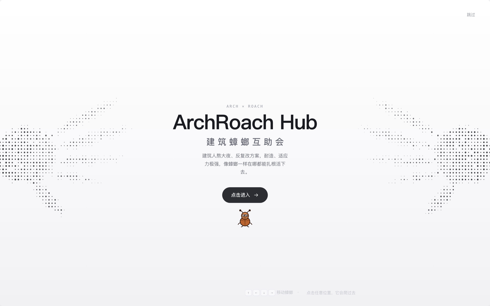

The hands are not an image: a handful of rotated ellipses form the silhouette, which is then sampled on a grid into dots that thin out toward the fingertips. Crisp at any size, no extra assets.

---

## Screenshots

> Captured from the running app with headless Chrome (`screenshots/`). The UI is Chinese by default.

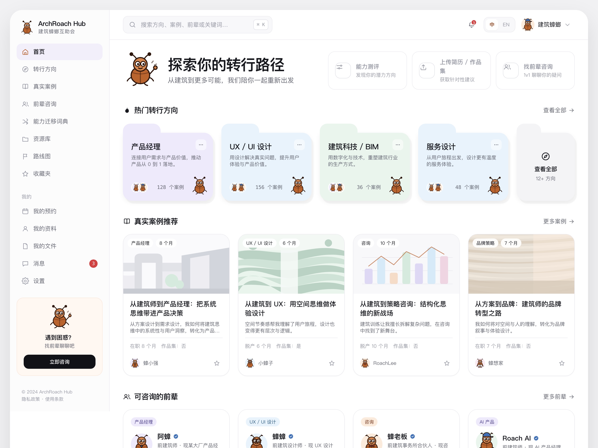

| Career paths | Path detail |
| --- | --- |
| 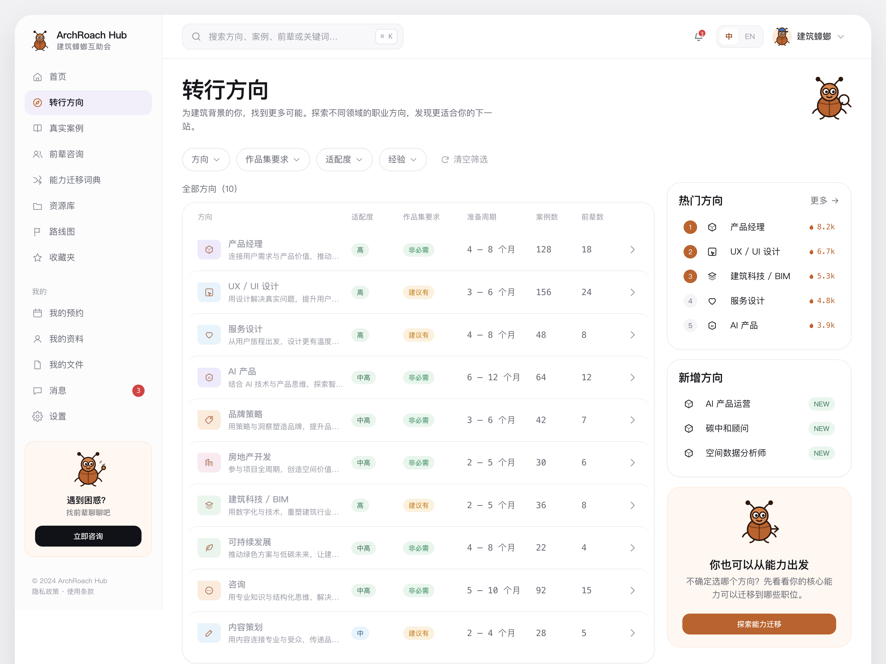 | 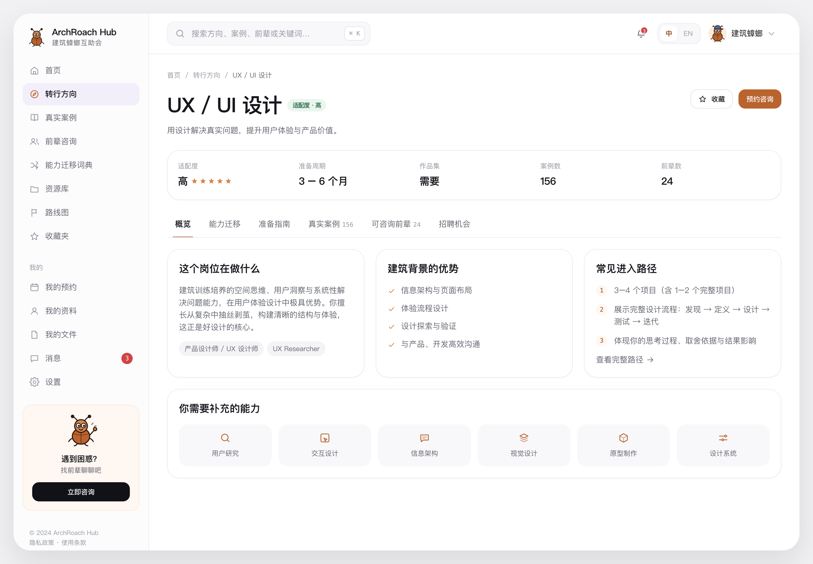 |

| Real stories | Story detail |
| --- | --- |
| 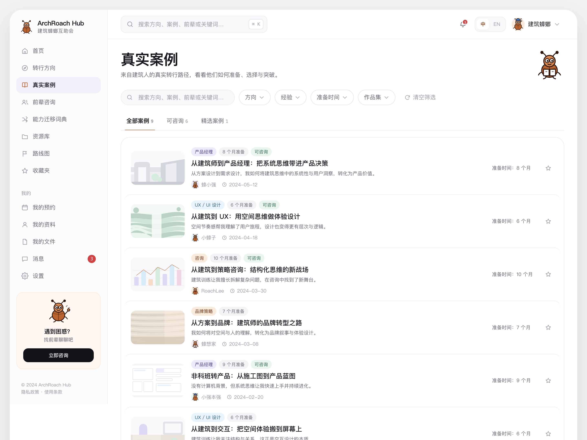 | 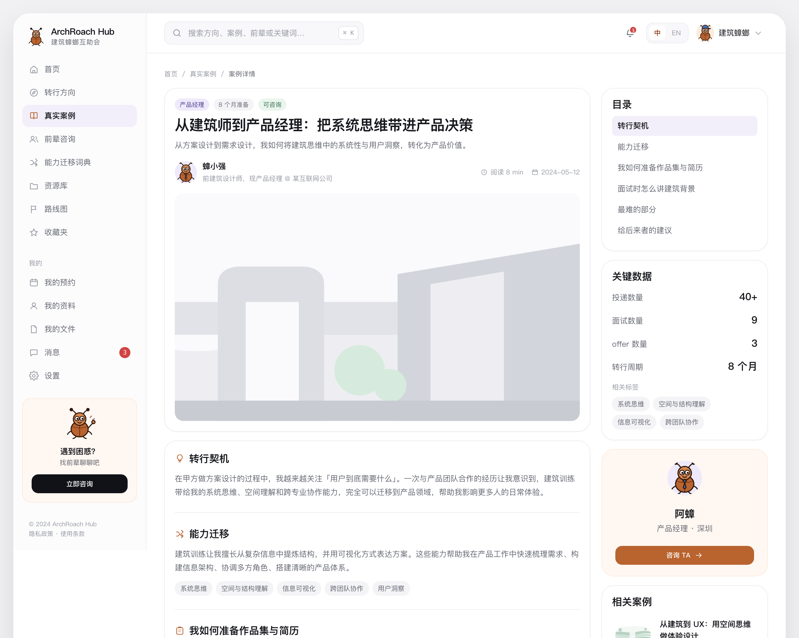 |

| Skill transfer | Mentors |
| --- | --- |
| 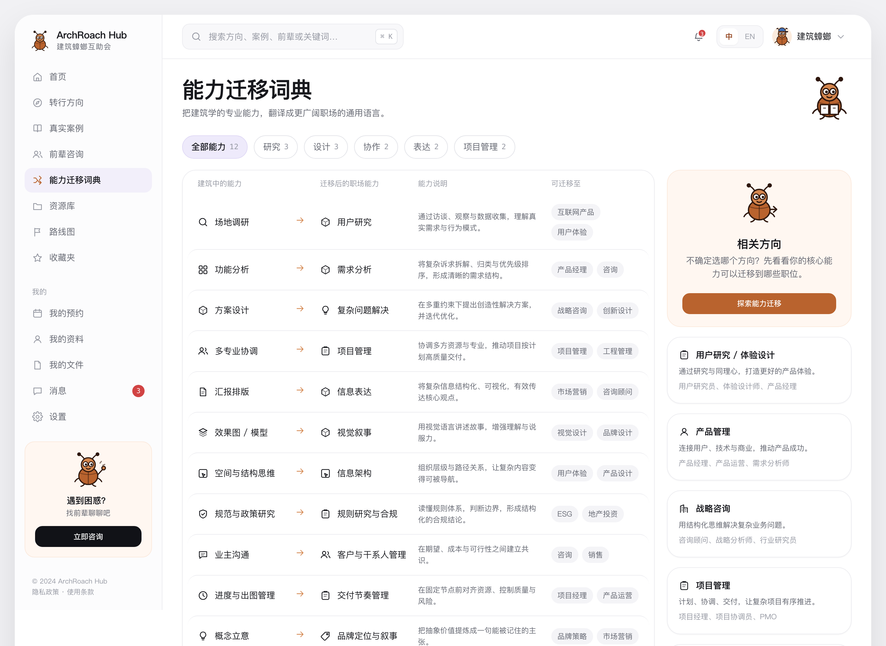 | 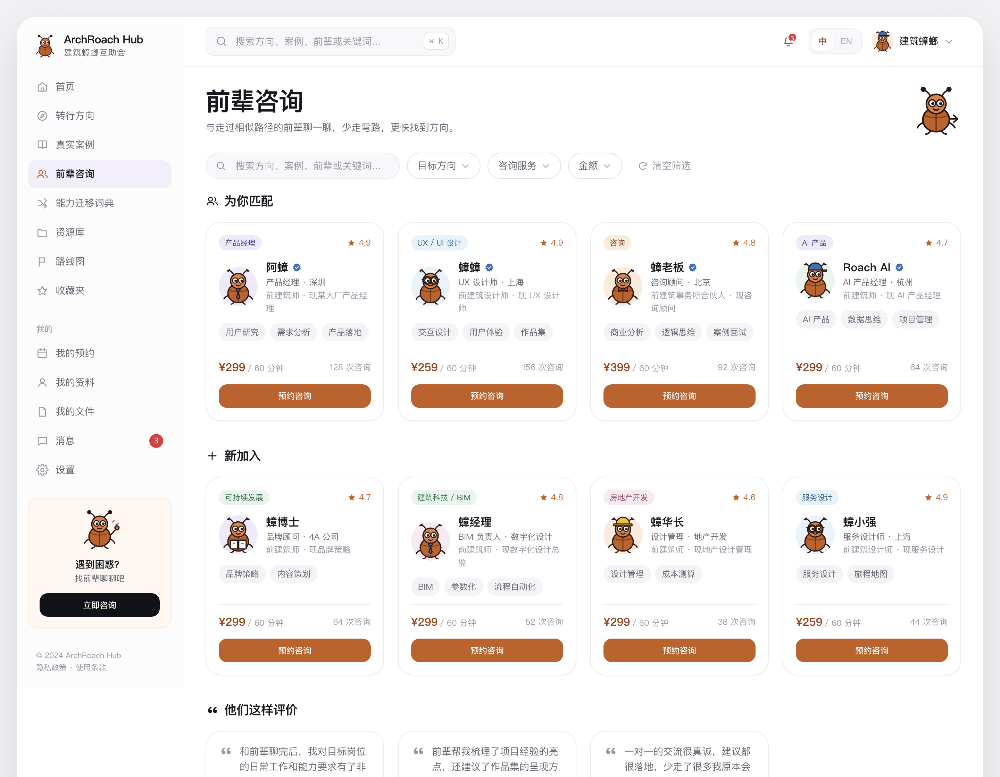 |

| Booking | My center |
| --- | --- |
| 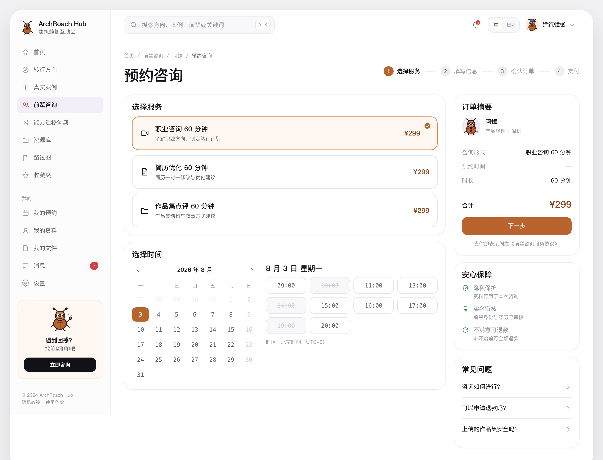 | 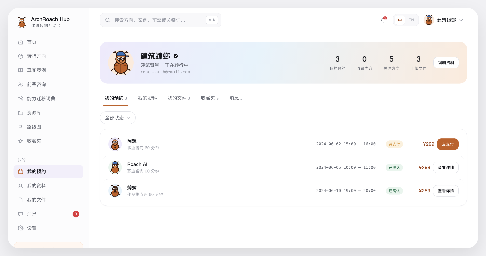 |

**English UI**

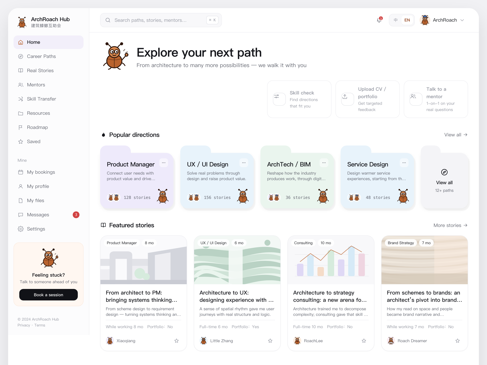

---

## What's on the site

- **Career paths** — each one laid out plainly: fit, whether you need a portfolio, prep time, common entry routes, skills to add
- **Real stories** — anonymous but consistently structured transition paths, from the trigger through skill transfer and materials to interviews and the hardest part
- **Skill transfer dictionary** — translates "site research", "scheme iteration" and "multi-discipline coordination" into language the job market understands, then points to matching roles
- **Mentors** — talk to people who already made the move; specialties, services and prices are visible up front
- **Resources / Roadmap** — roles open to architecture backgrounds, CV and portfolio guides, and a six-step path

Content is still growing.

---

## About this version

This is a **fully clickable front-end prototype**. Please note:

- No backend and no accounts. Paths, stories, mentors and jobs are sample content in `assets/js/data-*.js` — not real people or roles.
- The booking flow is a UI demo. Nothing is charged.
- Saved items and language preference live in browser storage and do not sync across devices.
- Story covers and mentor avatars are SVG illustrations drawn in code, not photographs.

Real content, authentication and payments come in later versions.

---

## Implementation

Deliberately simple: **no framework, no build step, no dependencies.**

- Plain HTML / CSS / JavaScript; hash routing, string-template rendering, event delegation
- Design tokens centralised in `assets/css/tokens.css`
- 12 roach poses, 45 icons and every story cover are inline SVG — zero external requests
- No ES modules and no `fetch`, so **opening `index.html` directly just works**

```
index.html          App shell: sidebar + top bar + SVG sprite
assets/css/         tokens / base / layout / components / pages
assets/js/
  i18n.js           Dictionary and language switching
  data-*.js         Content data
  ui.js  art.js     Render atoms and illustrations
  page-*.js         Pages
  app.js            Router, global search, drawer
docs/               Product spec, design system, design references
screenshots/        Screenshots used in this README
```

---

## Running locally

```bash
open index.html
```

Or serve it statically (needed for URL params such as `?lang=`):

```bash
python3 -m http.server 4173
# http://localhost:4173/
```

No `npm install` required.

---

## Deployment

Hosted on Vercel as a static site:

```bash
npx vercel deploy --prod
```

`vercel.json` sets CSP, HSTS, `X-Content-Type-Options` and friends. `.vercelignore` keeps `docs/` and `screenshots/` out of the deployed bundle.

---

## Design notes

A cool grey-white workbench. Roach brown `#B9632E` appears only on primary buttons, the logo and small accents. Top-level content sits in **folder cards**; muted pastels are used purely for category recognition.

The roach is a brand component, not an emoji — waving, pointing, holding a magnifier, hugging a folder, celebrating, wearing a tie / glasses / hard hat. It shows up in the logo, guidance, empty states and mentor avatars. Full spec in [`docs/design-system.md`](docs/design-system.md); product definition and privacy rules in [`docs/SPEC_建筑蟑螂互助会_PRD与MVP_v1.0.md`](docs/SPEC_建筑蟑螂互助会_PRD与MVP_v1.0.md) (Chinese).

One content rule throughout: **stories publish categories and ranges only** — discipline, experience band, prep time — never schools, exact employers or exact salaries. Mentors use nicknames and illustrated avatars.

---

## Status

- Done: every page and interaction is clickable, bilingual, responsive (no horizontal overflow at 1440 / 1024 / 390), no console errors
- Not done: automated tests, cross-browser verification, accessibility tooling, performance baseline
- No license specified yet

Issues welcome — new directions, new stories, or corrections.
